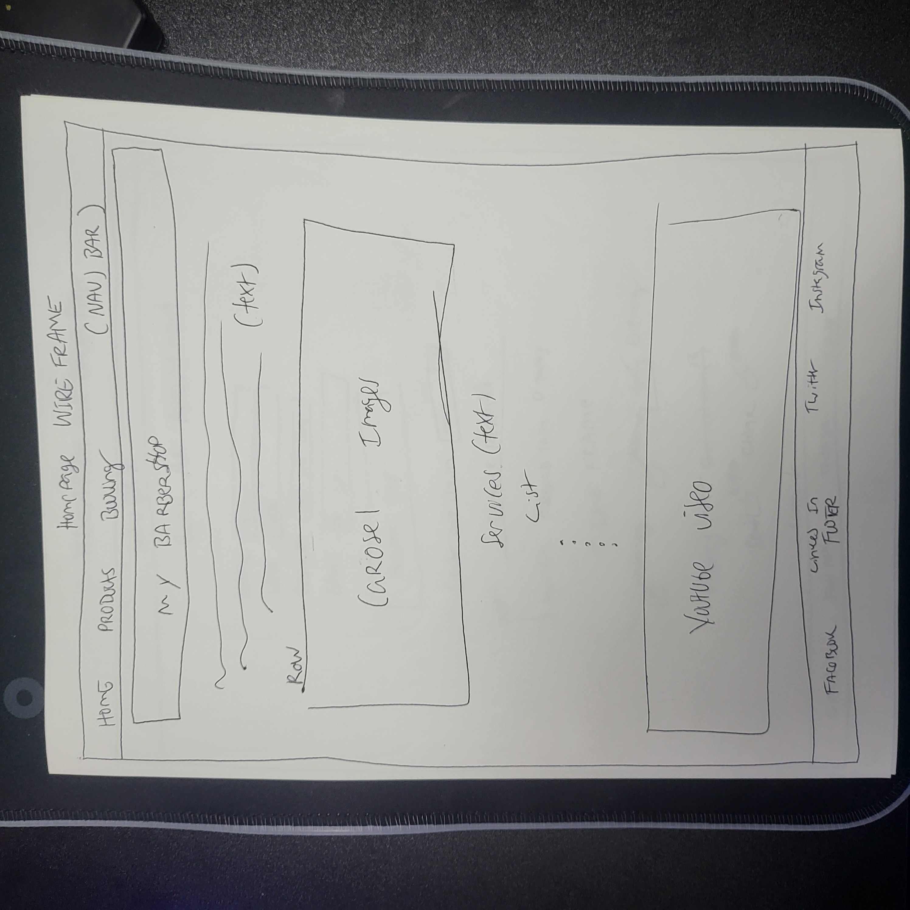

# T2's Barbershop

T2's Barbershop is a new loacation to get your hair cut for men and women of all ages. this website displays styles of haircuts and methods barbers use today. we prodive a list of the hair care products we use in our very own store to keep your hair healthy and ready for the next trim. if your'e not sure what style you would like we provided some pictures and a video of what we can do for you today.
A user could expect to be able to browse a few photos using the carousel and the youtube video proived. Another user could submit a form with a required name, phone number and email, while being able to submit a specific form about what type of haircut they would like and what time they would like to be seen. Finally another user could browse the products we have to offer and choose as many as they would like and submit them at the bottom of the page.
I would like to change a few functions about this web-page the first that I would change is the ability to use multiple carousels. I think this Bootstrap feature is very cool and could be useful for displaying relevant information and good pictures specifically for the type of business I presented with this project. The second idea for improvement I would add would be a search bar. Something that could pin-point information throughout the page and also help with navigation. The third change I would make to this page would be an actual submission form that could accept payments on the page, including credit card forms that are secured. I feel that this could help promote business and secure funds for employers who are distributing products and services. I would also like to be able to add a cart option for the products page so that users who are purchasing produts could do it in a more organzied manner.

  
  
  
### Technologies
- HTML
- CSS
- Bootstrap
- W3 Html Checker
